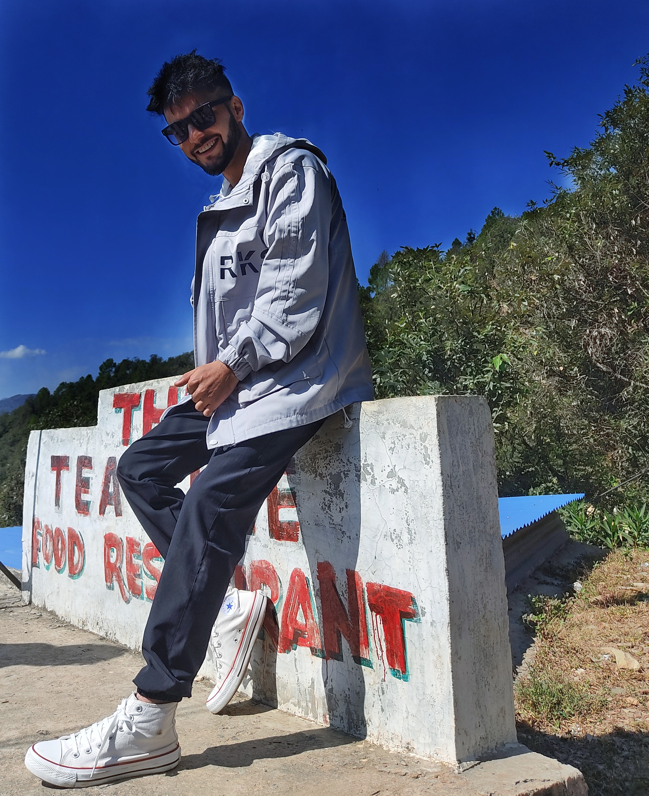
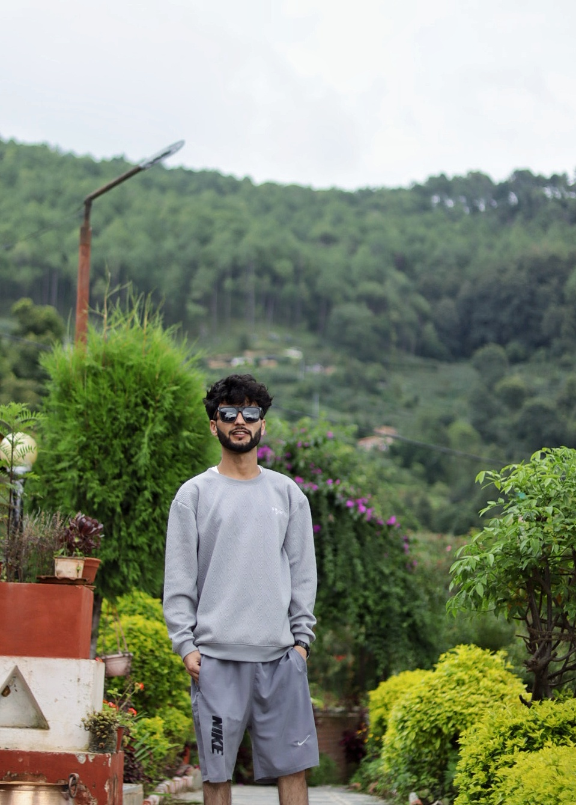

# 👨‍💻 Welcome to My Portfolio

Hi! I’m **Madhav Bhatta**, an aspiring **Computer Engineer** passionate about technology, problem-solving, and creating impactful projects through **software, AI, and modern web technologies**.  
This portfolio showcases my journey, projects, and skills as I continue to grow in the world of tech. 🚀  

---

## 🌐 MY Portfolio

 [SOMTHING MORE ABOUT ME](https://madhavbhatta11-69.lovable.app/)

## 🛠️ Project Info

The project is built using:

- ⚡ [Vite](https://vitejs.dev/)  - ⚛️ [React](https://react.dev/)  - 📘 [TypeScript](https://www.typescriptlang.org/)  - 🎨 [Tailwind CSS](https://tailwindcss.com/)  - 🧩 [shadcn-ui](https://ui.shadcn.com/)

---

---

## 📸  📸 

Here are some  sample snaps :  

  
  
  
  

  
  
  
  

---
## 🌱 Fun Fact  

When I’m not coding, I love **exploring new tech ideas**, sketching creative designs,  
and sometimes diving deep into **astrology & palmistry** 🔮 (a unique mix of logic + intuition!).  

## 📬 Contact Me  

  &nbsp;&nbsp;
  <!-- LinkedIn -->
  
  &nbsp;&nbsp;
  <!-- GitHub -->
  
  &nbsp;&nbsp;
  <!-- Twitter -->
  
  &nbsp;&nbsp;
  <!-- Facebook -->
  
  &nbsp;&nbsp;
  <!-- Instagram -->
  
  &nbsp;&nbsp;
  <!-- YouTube -->
  
  &nbsp;&nbsp;
   &nbsp;&nbsp;
 <!-- Telegram -->
  
<!-- WhatsApp -->

---

## 💬 Messaging  

If you’d like to reach me directly, feel free to open an issue in this repo or send me a message through my contact form on the portfolio site.  

---

## ⚙️ Development Guide 
## MADHAV BHATTA

